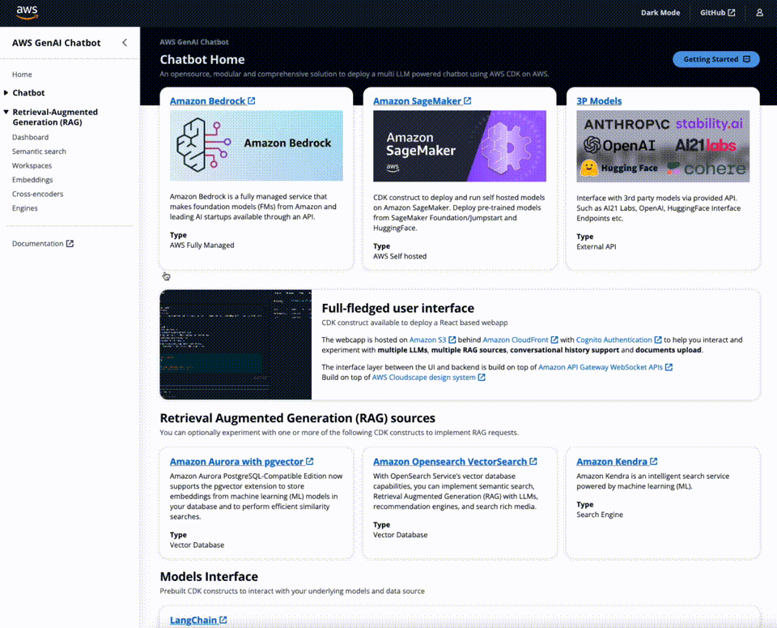

# Deploying a Multi-LLM and Multi-RAG Powered Chatbot Using AWS CDK on AWS

## Modular, comprehensive and ready to use
This solution provides ready-to-use code so you can start **experimenting with a variety of Large Language Models, settings and prompts.** in your own AWS account.

Supported models providers:
- [Amazon Bedrock](https://aws.amazon.com/bedrock/) 
- [Amazon SageMaker](https://aws.amazon.com/sagemaker/) self hosted models from Foundation, Jumpstart and HuggingFace.
- Third party providers via API such as Anthropic, Cohere, AI21 Labs, OpenAI, etc. [See available langchain integrations](https://python.langchain.com/docs/integrations/llms/) for a comprehensive list.

## Experiment multiple RAG options with Workspaces

## Unlock RAG potentianls with Workspaces Debugging Tools

## Full-fledged User Interface
The repository includes a CDK construct to deploy  a **full-fledged UI** built with [React](https://react.dev/) to interact with the deployed LLMs as chatbots. Hosted on [Amazon S3](https://aws.amazon.com/s3/) and distributed with [Amazon CloudFront](https://aws.amazon.com/cloudfront/). Protected with [Amazon Cognito Authentication](https://aws.amazon.com/cognito/) to help you interact and experiment with multiple LLMs, multiple RAG sources, conversational history support and documents upload.
The interface layer between the UI and backend is built with [Amazon API Gateway WebSocket APIs](https://docs.aws.amazon.com/apigateway/latest/developerguide/apigateway-websocket-api.html).

Build on top of [AWS Cloudscape Design System](https://cloudscape.design/).